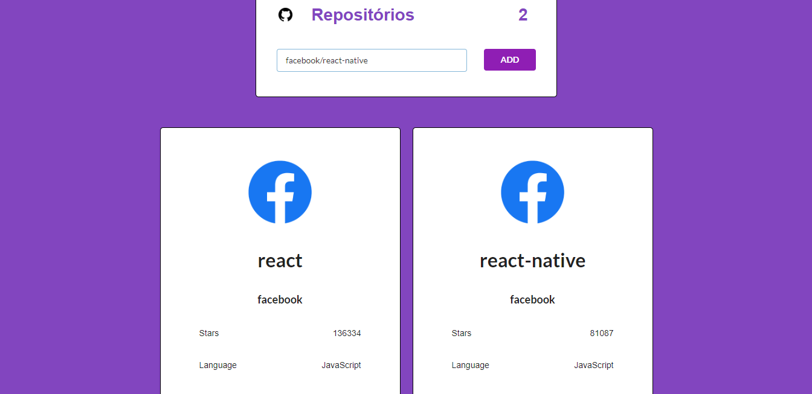

# GitHub Repository Manager

A GitHub API based application that allows you to add, remove and update repositories.
This app was developed using React and Redux.

## The following resources were used:

[GitHub API](https://developer.github.com/v3/) to get repositories informations.

[Axios](https://github.com/axios/axios) to make asynchronous requests.

[FontAwesome](https://github.com/FortAwesome/react-fontawesome) to get icons.



## How to start the app

The project uses Node.js and the Create-React-App starter. If you do not have Node >= 6.x installed, you can download it here: [Node.js](https://nodejs.org/en/)

Once Node is installed, navigate to the directory where you want to store the app
```
git clone https://github.com/raphaellibellini/neighborhood-map.git
npm install
```
Once all of the dependencies have been installed you can launch the app with
```
npm start
```
A new browser window should automatically open displaying the app. If it doesn't, navigate to [http://localhost:3000/](http://localhost:3000/) in your browser
